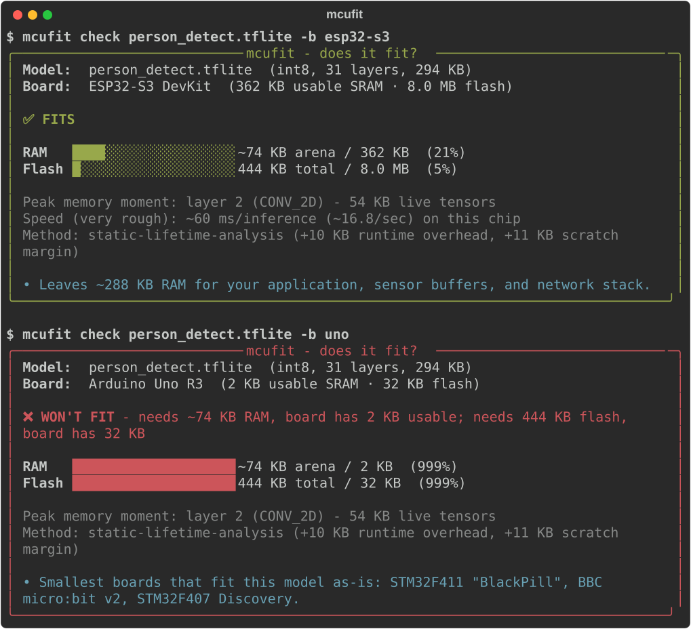

<div align="center">

# 📟 mcufit

**Know if your AI model fits your microcontroller - before you flash it.**

[](https://pypi.org/project/mcufit/)
[](https://github.com/avionicharshit-byte/mcufit/actions/workflows/ci.yml)
[](https://pypi.org/project/mcufit/)
[](LICENSE)

### [🌐 **Try it in your browser - drop a model, get a verdict, nothing to install**](https://avionicharshit-byte.github.io/mcufit/)

*Runs entirely client-side. Your model never leaves your device.*

<br>



</div>

---

Deploying ML to a microcontroller today works like this: train, convert,
flash, watch it crash with `Arena size is too small`, guess a bigger
number, re-flash, repeat. The official TFLite Micro docs literally say the
memory size *"may need to be determined by experimentation."*

**mcufit replaces the experimentation with an answer in one second.**

```bash
pip install mcufit
mcufit check model.tflite --board esp32-s3
```

## Features

- ⚡ **Instant fit verdict** - RAM & flash bars, headroom, and the exact layer where memory peaks
- 🎯 **Measured, not estimated** - runs your model through the *real* TFLite Micro runtime, automatically, whenever `node` is installed. No flag, no hardware, no build step
- 🌐 **Browser version** - same engine via WebAssembly, fully private, no install
- 🔌 **31 boards** - ESP32 family, Pico, STM32, Teensy, Arduino, and more
- 🤖 **CI guard** - a GitHub Action that fails the PR when your model outgrows the chip
- 💡 **Actionable suggestions** - int8 quantization preview (simulated, not guessed) and which boards *do* fit
- ⏱️ **Speed, measured** - ms/inference on the boards actually benchmarked on hardware, and silence on the rest
- 📦 **ONNX support** - `pip install 'mcufit[onnx]'` for the PyTorch world. A first look before you convert, and it says so: TFLM cannot run ONNX, so the verdict describes a `.tflite` you have not made yet

## Commands

| Command | What you get |
|---|---|
| `mcufit check model.tflite -b esp32-s3` | Fit verdict (exit code 1 on ❌ - CI-friendly). Measures with the real runtime if `node` is present |
| `mcufit check ... --exact` | Force the measurement, and fail rather than fall back |
| `mcufit compare model.tflite` | Verdict matrix across all 31 boards |
| `mcufit inspect model.tflite` | Layer-by-layer memory profile |
| `mcufit boards` | The board database |
| `mcufit setup-exact` | Native fallback build, only if node is unavailable |
| `... --json` | Machine-readable output for scripts & CI |

## How the arena number is produced

If `node` is on your PATH, `mcufit check` runs your model through the actual
TFLite Micro interpreter and reads its recorded allocations. This is the
default: it costs about 0.1 s and needs no flag, no compiler and no hardware,
because the interpreter ships in the wheel compiled to wasm32.

```bash
mcufit check model.tflite -b esp32-s3            # measures, if node is installed
mcufit check model.tflite -b esp32-s3 --exact    # require it; fail instead of falling back
```

Without node it falls back to static analysis, which is **deliberately
conservative and says so in its output**. Up to v0.4.0 that fallback was the
default and it read 6,153 bytes *below* a real ESP32 on the person-detection
model, so mcufit would have called it a fit on a board it does not fit. If you
are on the old behaviour, install node or upgrade.

### How close it gets

Activation tensors come straight from the model, so their size is identical
everywhere and that half of the number is exact. The interpreter's own
bookkeeping is full of pointers, so its size follows the pointer width of
whatever the interpreter was compiled for.

Measured against a real ESP32-D0WDQ6 at 240 MHz, person_detect
([mcufit-bench](https://github.com/avionicharshit-byte/mcufit-bench),
2026-08-16):

| arena section | host build, 64-bit | wasm32 | real device |
|---|---|---|---|
| activations | 55,296 | 55,296 | 55,296 |
| interpreter overhead | 33,952 | 29,132 | 27,004 |
| **total** | **89,248** | **84,428** | **82,300** |
| error vs device | +8.4% | +2.6% | - |

wasm32 is 32-bit like the chip, which is why mcufit uses it. What is left is
struct padding that differs from Xtensa, and it is **a fixed 2,128 bytes, not a
percentage**. Measured across all four benchmark models on a real ESP32 the
overshoot was 2,128 B every single time, which is 2.6% of the person-detection
arena and 89% of the anomaly detector's. It reads high rather than low, which
is the safe direction for a fit check, and the tool now states the overshoot in
bytes and what it is worth for your model.

It is not subtracted, because it belongs to a (TFLM version, target ABI) pair
rather than to wasm32: against a Nano 33 BLE the same four deltas are 744,
1,304, 1,688 and 1,912. Subtracting the ESP32 figure everywhere would make the
tool read low on other targets.

`mcufit setup-exact` still builds the native 64-bit interpreter, for machines
without node. It is the less accurate path and the CLI warns when it uses it.

## What the flash number is, and is not

Flash counts **the model plus the TFLite Micro runtime and kernels**, and
nothing else. The runtime figure is measured, not assumed: compiling an empty
sketch and diffing against the benchmark firmware gives 84,528 B on a Nano 33
BLE and 114,579 B on an Arduino Nano ESP32, and mcufit uses the larger.

It does **not** include your application, the RTOS, the radio stack or the
bootloader, because mcufit cannot see them. Those are not small: an empty
Arduino sketch alone is 85 KB on a Nano 33 BLE and 347 KB on an ESP32-S3.

So the flash figure is a **floor**. A ❌ on flash is certain. A ✅ means the
model and runtime fit, and the report tells you how much room is left for
everything else. Up to v0.5.1 this was a flat hardcoded 150 KB that nothing had
ever validated, and it read about 3% under real firmware.

## Speed

Only `esp32` and `nano33ble` have been measured on hardware. Every other board
returns no speed number.

| board | validated error |
|---|---|
| `esp32` | -6% to +4% |
| `nano33ble` | -11% to +20% |

Speed is not derivable from a datasheet. Which operators run fast depends on
which kernels the vendor wrote, and that is not documented anywhere. Measured
per operator, in MACs/cycle:

| operator | ESP32 (esp-nn) | Nano 33 BLE (CMSIS-NN) |
|---|---|---|
| CONV_2D | 0.073 | 0.190 |
| DEPTHWISE_CONV_2D | 0.044 | 0.063 |
| FULLY_CONNECTED | 0.022 | 0.186 |

Each chip is slow at a different operator. On the ESP32 fully-connected costs
3.2x more than convolution, because esp-nn ships no kernel for it and it falls
back to reference C. On the nRF52840 fully-connected is fine and depthwise is
the slow one, at 3.3x.

Before this, every board carried a hand-written `macs_per_cycle`. Those were
wrong by up to 3.2x and ranked the two chips the wrong way round. They are
gone. Numbers come from
[mcufit-bench](https://github.com/avionicharshit-byte/mcufit-bench).

## Guard your model in CI

```yaml
- uses: avionicharshit-byte/mcufit@main
  with:
    model: models/wake_word.tflite
    board: esp32-s3
```

A model that grows past the board's RAM now fails the pull request instead
of the field deployment.

<details>
<summary><b>Supported boards</b> (31 across 7 vendors - click to expand)</summary>
<br>

| Vendor | Boards |
|---|---|
| Arduino | Uno R3/R4, Mega 2560, Nano 33 BLE Sense, Nano 33 IoT, Portenta H7 |
| Espressif | ESP32, S2, S3, C3, C6, P4, ESP8266, ESP32-CAM, M5Stack Core2 |
| Raspberry Pi | Pico, Pico W, Pico 2 |
| STM32 | F103 Blue Pill, F411 BlackPill, F407 Discovery, F746 Discovery, H743 Nucleo |
| Seeed Studio | XIAO ESP32S3 Sense, XIAO nRF52840 Sense, Wio Terminal |
| Teensy | 4.0, 4.1 |
| Other | SparkFun Edge, BBC micro:bit v2, nRF52832 DK |

Missing yours? **Adding a board is a 10-line PR** to
[`boards.yaml`](src/mcufit/boards/data/boards.yaml) - CI validates it
automatically.

</details>

<details>
<summary><b>How it works</b></summary>
<br>

The RAM bottleneck on microcontrollers is the **tensor arena**: every
intermediate tensor alive at the same moment must fit in SRAM at once.
mcufit parses the model file directly (weights → flash, activations →
RAM), computes tensor lifetimes across the execution schedule, and finds
the peak - the same quantity TFLM's memory planner must pack. Exact mode
skips the math and asks the real runtime, with the pointer-width caveat
above. Board verdicts account for the
RAM your RTOS/Wi-Fi stack already eats before your app gets any.

</details>

## Why this exists

Pre-deployment memory estimation has been requested in the TensorFlow
repos since [2019](https://github.com/tensorflow/tensorflow/issues/35070) -
never shipped. A TFLite Micro maintainer,
[March 2024](https://github.com/tensorflow/tflite-micro/issues/2474#issuecomment-2015406610):

> *"We don't have a python based tool for determining arena size…"*

Vendor tools (STM32Cube.AI, eIQ) answer only for their own silicon.
**mcufit is the neutral, open version.**

## License

MIT
